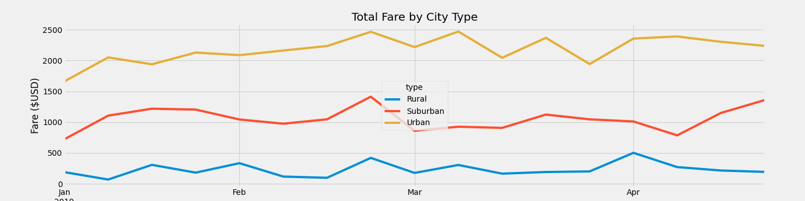

# PyBer_Analysis

## Overview:
The purpose of this project was to take data for a rideshare company and perform an analysis. The requested was a breakdown, by city type, of number of rides, drivers, total fares, and average fares per ride and driver. The analysis included a line chart plotting the total weekly fares per city type, for the months January through April of 2019.
## Results:
The results from my analysis showed some clear differences between the rural, suburban, and urban city types. First, Urban cities had more rides overall; more than 1000% higher than rural areas and nearly 200% more than suburban. The comparison of total fares by city type showed the same differences as number of rides. Looking at number of drivers, however, showed that the urban city type had 3,000% more drivers than rural and 500% more than suburban. Because of the discrepancy in drivers, the average fare per driver was highest in rural areas and lowest in urban. The average fare per ride was also highest in rural and lowest in urban. The visual analysis showed that fares were lowest in January and slowly rose in March through April

## Summary:
Based on the analysis I would recommend the following:
1.	Increase marketing in rural areas. With a higher fare per ride and per driver, increasing the number of rides taken in rural areas could increase margins
2.	Look into how to increase demand during January. January is clearly the slowest month. Is this true for all winter months? Possibly increase marketing or run specials to increase number of rides and fares.
3.	Find a way to better utilize urban drivers. There are too many drivers for the market, driving down the amount of money brought in per driver. Either number of rides needs to be increased, or number of drivers decreased.
